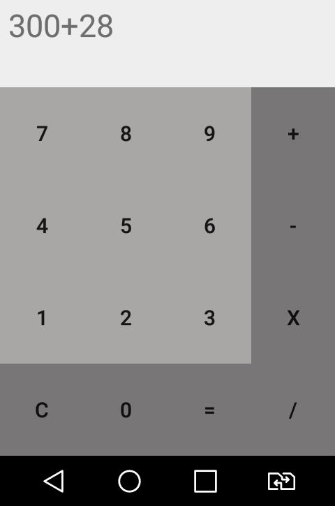
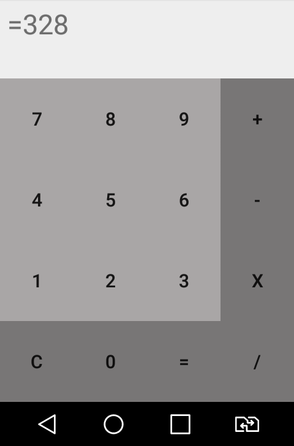

# Calculator

A simple Calculator app for practice. 

Currently contains : 
1. Basic Aithmetic calculations (addition,  subtraction, multiplication, division).

Things to add : 
1. Indices, Roots, Logarithmic functions.
2. Scientific calculations.
3. Trigonometric calculations.
4. Hyperbolic functions' calculations. 
5. Degree and radian calculations. 

